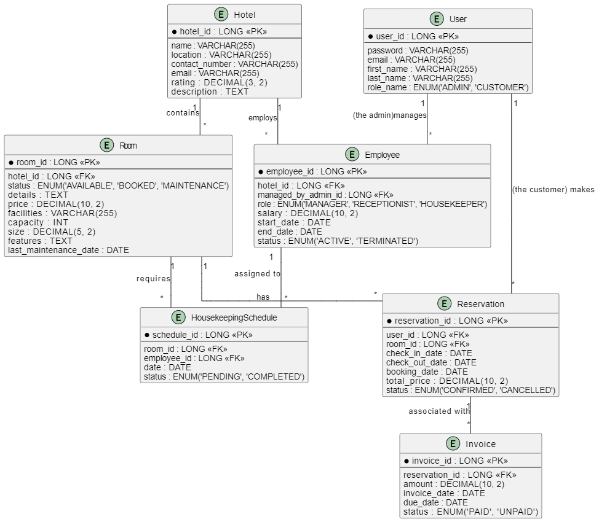

# Hotel Management System


## Project Overview
The Hotel Management System (HMS) project aims to create a comprehensive platform to manage hotel operations efficiently. The system includes functionalities for customer and employee management, room reservations, housekeeping schedules, billing, and more. The backend is built using Spring Boot, and the APIs are documented using OAS 3.1.0 standards. The application is containerized using Docker and managed with Docker Compose.

---

## Features

1. **Customer Management**
    - **User Registration and Login**: Allow users to create accounts and securely log in to the system.

2. **Employee Management**
    - **Admin Control**: Admins can manage hotel employees, including adding new employees, updating their information.
   
3. **Search Functionality**
    - **Reservation Search**: Users can search for reservations by customer name, ID, or date.
    - **Room Availability Search**: Search for available rooms, displaying detailed information such as price, facilities, capacity, size, and features.

4. **Reservation Management**
    - **Booking Rooms**: Customers can book one or multiple rooms.
    - **Modify Reservations**: Customers can modify their existing reservations.
    - **Cancel Reservations**: Customers can request reservation cancellations, which require admin approval.

5. **Room Management**
    - **Room Type Management**: Admins can manage different types of rooms, including their features and pricing.
    - **Availability and Status**: Admins can update room availability and status (e.g., available, booked, maintenance).

6. **Check-In/Check-Out Process**
    - **Customer Check-In**: Admins can manage the check-in process, updating room status and customer records.
    - **Customer Check-Out**: Admins can manage the check-out process, ensuring rooms are available for new guests.

7. **Housekeeping Management**
    - **Task Scheduling**: Schedule housekeeping tasks for rooms.
    - **Task Tracking**: Track the progress of housekeeping tasks and assign employees to specific tasks.

8. **Billing**
    - **Invoice Generation**: Generate invoices for customer reservations, including detailed billing information.
    - **Invoice Management**: Admins and customers can view and manage invoices, including payment status.

9. **Role-Based Access Control**
    - **Access Permissions**: Different functionalities are available based on user roles (admin, customer). Admins have broader access to management features, while customers have access to booking and profile management features.

10. **API Security**
    - **JWT Authentication**: Secure the APIs using JSON Web Tokens (JWT) to ensure that only authenticated and authorized users can access certain endpoints.

11. **API Versioning**
    - **Versioning Techniques**: Implement API versioning using different approaches (e.g., URL versioning, query parameter versioning, header versioning) to demonstrate best practices in maintaining backward compatibility.

12. **Database Initialization**
    - **Automatic Setup**: Initialize the database with the necessary structure and populate it with initial and sample data automatically to facilitate testing and development.


## ER Diagram


## Technologies Used

- Spring Boot
- Docker
- JWT for security
- OpenAPI 3.1.0 for API documentation
- MySQL for the database
- Postman for API testing

## Setup Instructions

### Prerequisites

- Java JDK
- Docker
- Docker Compose
- Git

### Building and Running the Application

1. **Initialize Git and Set Remote**

    ```bash
    git init
    git remote add origin https://github.com/kotkot21/project2-hotel-management-system.git
    git pull origin main
    ```
2. **Build the Application**

    ```bash
    ./mvnw clean install
    ```
4. **Create Doceker Image**

    ```bash
   docker login
   docker build -t abua6937431/inv-app .
   docker push abua6937431/inv-app
    ```

5. **Run the Application with Docker Compose**

    ```bash
    docker-compose up --build
    ```

6. **Push to GitHub**

    ```bash
    git add .
    git commit -m "Initial commit"
    git push origin main
    ```

### Docker Image

The Docker image for this application can be found on DockerHub: https://hub.docker.com/repository/docker/abua6937431/hotel-app

### Postman Collection

The Postman collection for testing the APIs can be found in the repository under the file `postman_collection.json`.

## API Documentation

The API documentation is generated using OpenAPI 3.1.0 standards and can be accessed at `http://localhost:8080/swagger-ui/index.html` once the application is running.

## Lessons Learned

- Implementing role-based access control using JWT.
- Designing RESTful APIs with proper versioning techniques.
- Setting up and running a Spring Boot application with Docker and Docker Compose.
- Utilizing OpenAPI for API documentation.
- Applying best practices in exception handling and data validation.

---

## Contributors:

### Ahmad Naser-1201496
### Yazan Zidan-1193162

---
